# 📋 Инструкция по сборке аккумуляторной батареи (АКБ)

---

## ⚠️ ПРАВИЛА БЕЗОПАСНОСТИ

| НЕЛЬЗЯ | МОЖНО |
|--------|-------|
| ❌ Работать без защитных очков и перчаток | ✅ Надеть очки + перчатки |
| ❌ Кладать инструменты на АКБ | ✅ Чистое рабочее место |
| ❌ Использовать вздутые/битые ячейки | ✅ Отбраковать брак |
| ❌ Замыкать контакты металлом | ✅ Заклеивать скотчем |

---

## 🔧 ЭТАП 1: ПОДГОТОВКА ЯЧЕЕК

| № | Действие | Изображение |
|---|----------|-------------|
| 1 | **Разложить ячейки** Плюсы (+) всех ячеек смотрят в одну сторону. Проверить напряжение мультиметром: 3.6–3.8 В. Меньше 3.0 В — не использовать! | |
| 2 | **Зафиксировать ячейки** Расставить ячейки согласно схеме, прижать крепежным приспособлением, чтобы временно зафиксировать. |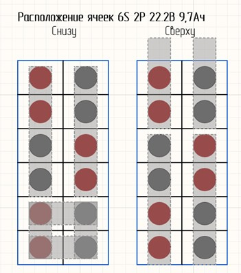 |
| 3 | **Нанести термоклей между ячейками** Нанести в местах соприкосновения «бочков» — фиксация + отвод тепла. | |
| 4 | **Закрепить скотчем** Обмотать сборку 2–3 раза армированным скотчем для фиксации. | |
| 5 | **Приклеить изоляционный круглые прокладки**   Приклеить в два слоя со стороны плюса аккумуляторной ячейки |  | 
| 6 | **Убрать крепежное приспособление** 

---

## 🔌 ЭТАП 2: ПОДГОТОВКА ПЛАТЫ БАЛАНСИРА

| № | Действие | Изображение |
|---|----------|-------------|
| 5 | **Залудить дорожки на плате** Нагреть дорожку, канифоль → припой. Равномерно нанести припой. | 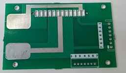 |
| 6 | **Припаять медные пластины** Толстые медные пластины припаять к дорожкам на плате (+) и (–) платы. | 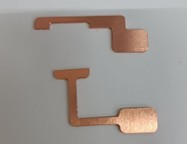 |
| 7 | **Обрезать боковины разъёма** Откусить кусачками «ушки» у белого разъёма. | 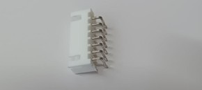 |
| 8 | **Припаять разъём** Припаять к плате разъемы: балансировочный и зарядки/разрядки. | 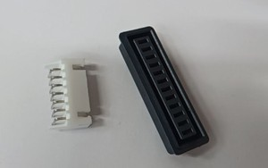 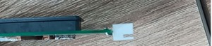 |
| 9 | **Припаять балансировочные провода к плате** Припаять провода к контактам 2-6 | 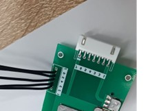 |
| 10 | **Припаять никелевые/медные ленты к плате** Необходимо двойные никелевые ленты. Их перед пайкой необходимо зачистить нождачной бумагой для лучшего лужения. | 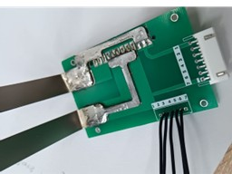 |

---

## 🔩 ЭТАП 3: СОЕДИНЕНИЕ ЯЧЕЕК И ПЛАТЫ

| № | Действие | Изображение |
|---|----------|-------------|
| 11 | **Установить стойки на плату** Пластиковые втулки для крепления к корпусу аккумуляторной батареи | 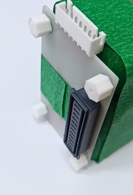 |
| 12 | **Приклеить электрокартон между батареей и платой** Вырезать прямоугольник, приклеить — изоляция. |  |
| 13 | **Приварить ленты между ячейками** Точечная сварка! Приварить ячейки согласно схеме выше. НЕ паяльником! | 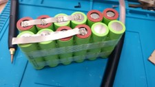 |
| 14 | **Припаять балансировочные провода к ячейкам** Зачистить места пайки и быстро залудить горячим паяльником. Долго не греть! |  |

---

## ✅ ЭТАП 4: ПРОВЕРКА

| № | Действие | Изображение |
|---|----------|-------------|
| 15 | **Проверить напряжение мультиметром** Общее: ~22.2 В (6S) . Каждая ячейка: ~3,7 В между проводами. |  |
| 16 | **Проверить балансиром** Подключить тестер — все ячейки должны отображаться, без «0 В». | |

---

## 🛡️ ЭТАП 5: ИЗОЛЯЦИЯ И УПАКОВКА

| № | Действие | Изображение |
|---|----------|-------------|
| 17 | **Приклеить электрокартон на открытые контакты** Закрыть места сварки лент — защита от случайного КЗ. | 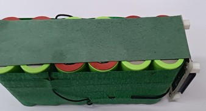 |
| 18 | **Обмотать клейкой лентой** по всей батарее — дополнительная защита. |  |
| 19 | **Надеть термоусадку и нагреть феном** Греть равномерно со всех сторон, пока плотно не обтянет. | |

---

## 💡 ВАЖНЫЕ ЗАМЕЧАНИЯ

| Что | Зачем |
|-----|-------|
| Проверка ячеек ДО сборки | Брак убивает всю батарею |
| Точечная сварка, не пайка | Пайка = перегрев = вздутие/пожар |
| Проверка каждой ячейки | Поймать ошибку до включения |
| Изолента перед термоусадкой | Защита от острых краёв |

